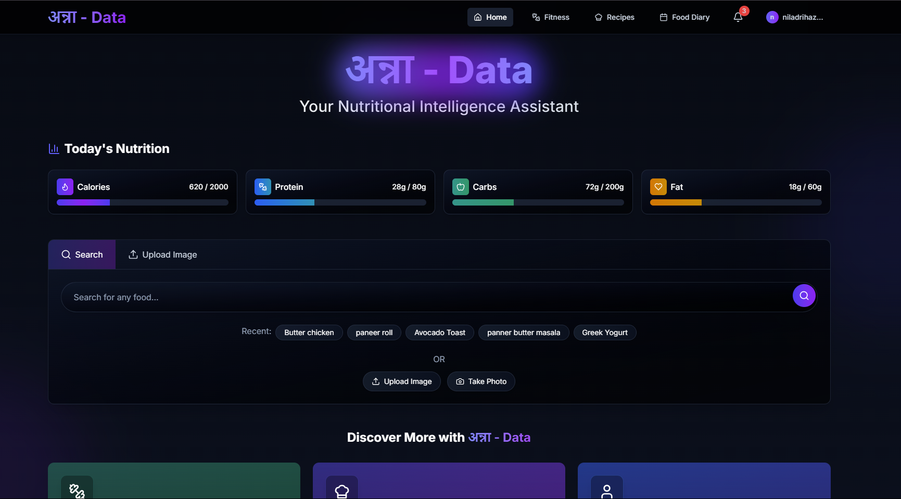
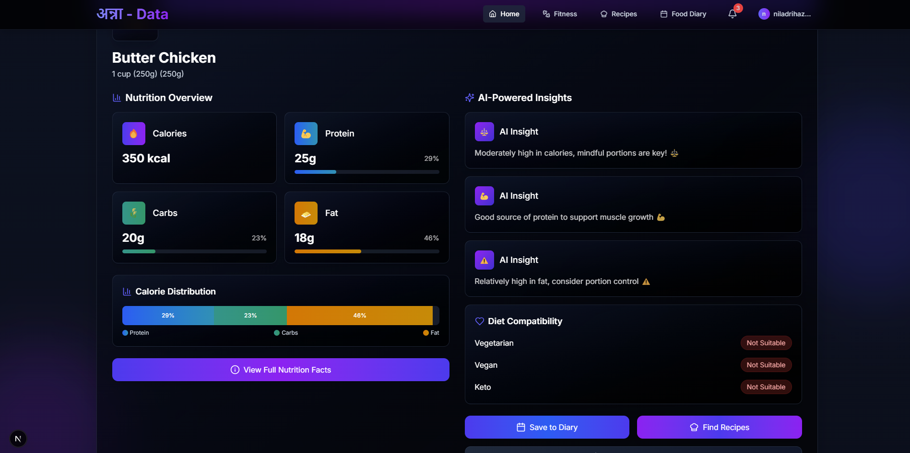
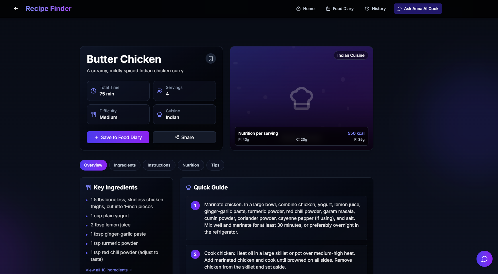
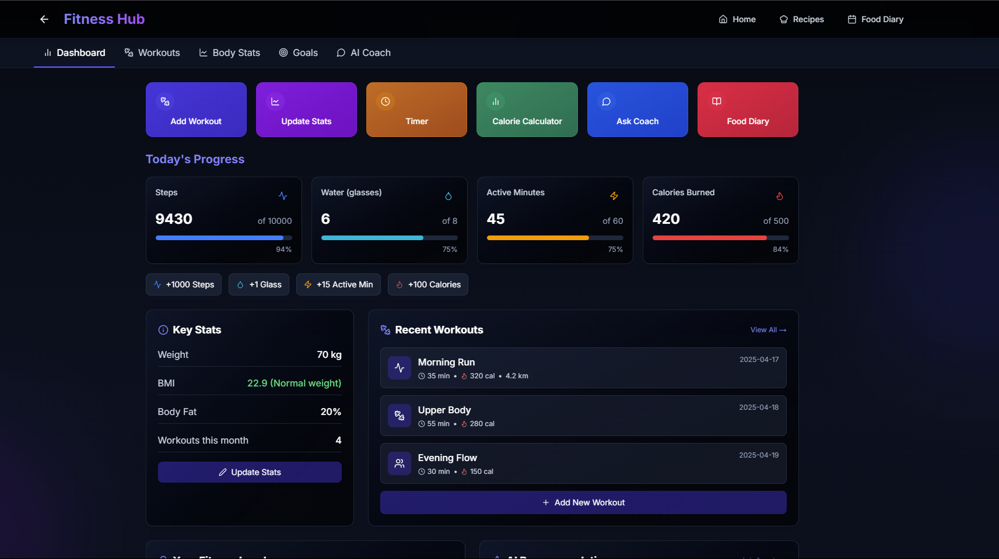
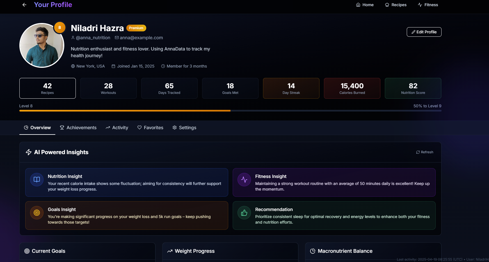

# 🌟 NutriSmart AI: Smart Eating, Smarter Living 🌟

NutriSmart AI is your intelligent nutrition coach, designed to make healthy eating simple, personalized, and actionable. Leveraging the power of AI, this application helps you understand your dietary habits, discover new recipes, plan your fitness, and achieve your wellness goals.



## 🚀 Overview

NutriSmart AI offers a comprehensive suite of tools to manage your nutritional journey:
- **Personalized Dashboard:** Get an at-a-glance view of your daily progress and AI-driven insights.
- **AI Food Diary:** Easily log your meals and get detailed nutritional analysis.
- **Recipe Finder:** Discover healthy recipes tailored to your dietary preferences and goals.
- **Image-Based Food Analysis:** Snap a photo of your meal to get instant nutritional information.
- **Fitness Planner:** Receive workout recommendations that complement your diet.
- **Smart Grocery Lists:** Generate shopping lists based on your meal plans and health objectives.
- **Secure Authentication:** Keep your personal health data safe and private.
- **Notifications & Reminders:** Stay on track with timely alerts and motivational messages.

## ✨ Key Features

### Dashboard
Your nutrition hub showing personalized stats, AI insights, and quick access to all features including diary, recipes, and fitness planning.



### Food Diary
Track meals with detailed nutrition data. View macro charts, filter by date, and receive AI insights on your eating patterns.

### Recipe Page
AI-powered recipe finder based on your preferences and goals. Get ingredients, instructions, and nutritional details with personalized recommendations.



### Fitness Page
Custom workout plans that complement your nutrition goals. Track exercises, monitor progress, and receive AI guidance on optimal meal timing.



### Profile Page
Your health command center displaying metrics, goals, and achievements. View progress charts and receive personalized AI insights.



### Grocery List
Smart shopping assistant with AI-recommended items based on your health profile. Organize by categories and export lists as PDFs.

### Image Generator
Visualize food nutrition through AI-generated graphics. Upload images or describe foods to see detailed nutrient breakdowns.

### Login Page
Secure access to your nutrition dashboard with streamlined authentication for new and returning users.

### Notifications
Timely alerts for meal reminders, water intake, and milestones. Receive personalized recommendations based on your activity patterns.

## 🛠️ Tech Stack

- **Frontend:** Next.js (v15+), React (v19+), Tailwind CSS (v4+), Framer Motion
- **Backend & API:** Next.js API Routes
- **AI & Machine Learning:**
  - Google Generative AI (`@google/generative-ai`)
  - OpenAI API (`openai`)
- **Database:** MongoDB (with Mongoose ODM)
- **Authentication:** Clerk (`@clerk/nextjs`) and NextAuth.js
- **State Management & Routing:** React Context, Next Navigation
- **Data Visualization:** Recharts
- **3D Visualizations:** Three.js with React Three Fiber and Drei
- **Utility Libraries:** Axios, Lucide React Icons, jsPDF & jspdf-autotable (for exports)
- **Theme Management:** next-themes
- **Linting & Formatting:** ESLint

## 💡 Inspiration

We noticed people struggle to turn nutrition advice into daily habits. Our inspiration was to make healthy eating simple, actionable, and fun with the help of AI.

## 🏁 Getting Started

Follow these instructions to get a local copy up and running.

### Prerequisites

- Node.js (v18 or later recommended)
- npm or yarn
- MongoDB instance (local or cloud-hosted like MongoDB Atlas)
- API Keys for:
  - Google Generative AI
  - OpenAI
  - Clerk

### Installation

1. **Clone the repository:**
   ```bash
   git clone <your-repository-url>
   cd "AI_Nutrition_Planner"
   ```

2. **Install dependencies:**
   ```bash
   npm install
   # or
   yarn install
   ```

3. **Set up Environment Variables:**
   Create a `.env.local` file in the project directory and add your API keys:
   ```env
   NEXT_PUBLIC_GEMINI_API_KEY=YOUR_GOOGLE_AI_API_KEY
   OPENAI_API_KEY=YOUR_OPENAI_API_KEY

   # Clerk Environment Variables
   NEXT_PUBLIC_CLERK_PUBLISHABLE_KEY=YOUR_CLERK_PUBLISHABLE_KEY
   CLERK_SECRET_KEY=YOUR_CLERK_SECRET_KEY
   NEXT_PUBLIC_CLERK_SIGN_IN_URL=/login
   NEXT_PUBLIC_CLERK_SIGN_UP_URL=/login
   NEXT_PUBLIC_CLERK_AFTER_SIGN_IN_URL=/
   NEXT_PUBLIC_CLERK_AFTER_SIGN_UP_URL=/

   # MongoDB Connection URI
   MONGODB_URI=YOUR_MONGODB_CONNECTION_STRING

   # NextAuth.js
   NEXTAUTH_URL=http://localhost:3000
   NEXTAUTH_SECRET=YOUR_NEXTAUTH_SECRET
   ```

4. **Run the development server:**
   ```bash
   npm run dev
   # or
   yarn dev
   ```

5. Open [http://localhost:3000](http://localhost:3000) in your browser to see the application.

## 🚧 Challenges we ran into

We faced challenges in making AI recommendations accurate, keeping the UI simple, and ensuring fast, secure data handling.

## 🎉 Accomplishments that we're proud of

We're proud of our AI-powered food image analysis, personalized nutrition insights, and a user-friendly, visually engaging interface.

## 🧠 What we learned

We learned how to blend AI with user experience, visualize complex nutrition data, and build a product that truly helps people eat better.

## 🔮 What's next for NutriSmart AI

Next, we plan to add:
- Wearable device integration for holistic health tracking
- Community features for sharing recipes and progress
- Even smarter AI for advanced meal planning and adaptive fitness coaching
- Expanded food database and cultural recipe options
- Enhanced offline support for key features

## 🤝 Contributing

Contributions are welcome! If you have suggestions or want to contribute to the project, please feel free to:
1. Fork the Project
2. Create your Feature Branch (`git checkout -b feature/AmazingFeature`)
3. Commit your Changes (`git commit -m 'Add some AmazingFeature'`)
4. Push to the Branch (`git push origin feature/AmazingFeature`)
5. Open a Pull Request

## 📄 License

This project is licensed under the MIT License.

---

*Created with ❤️ by Team NutriSmart*